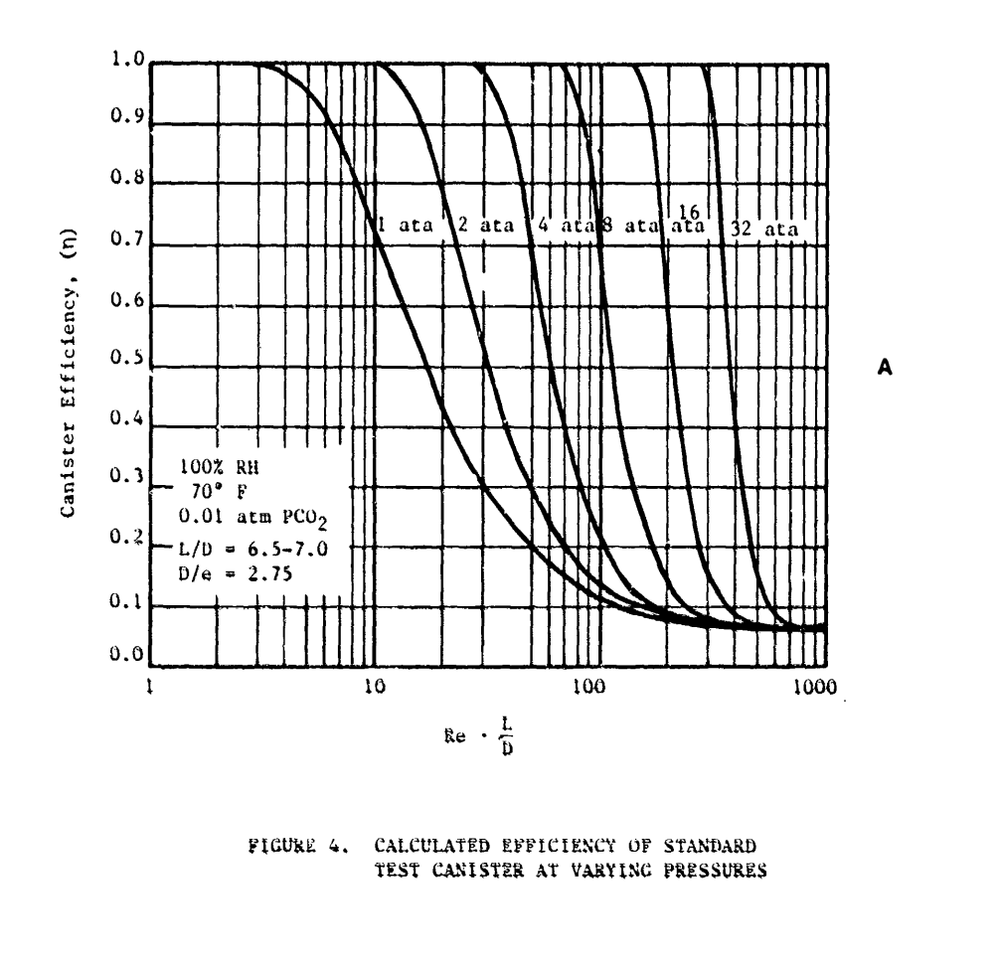
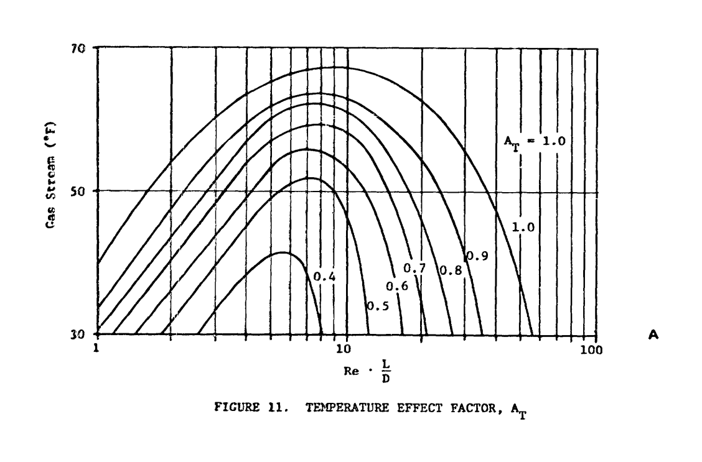
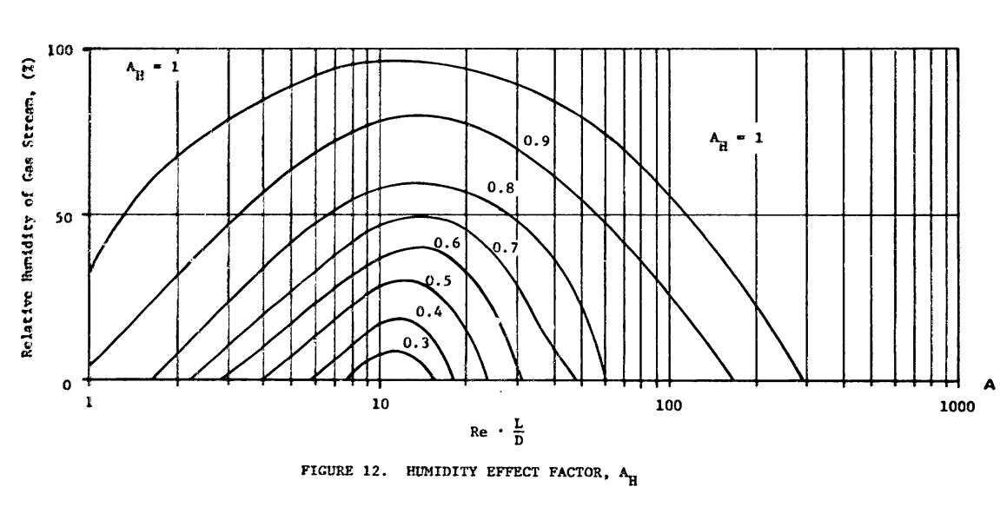
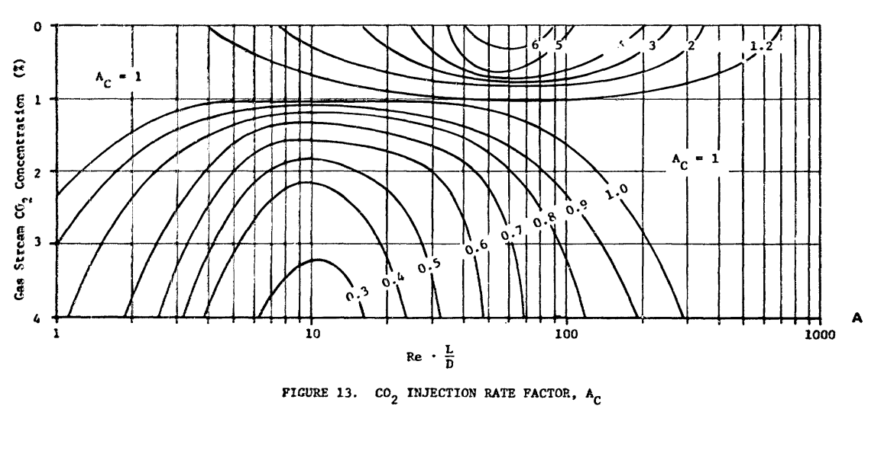
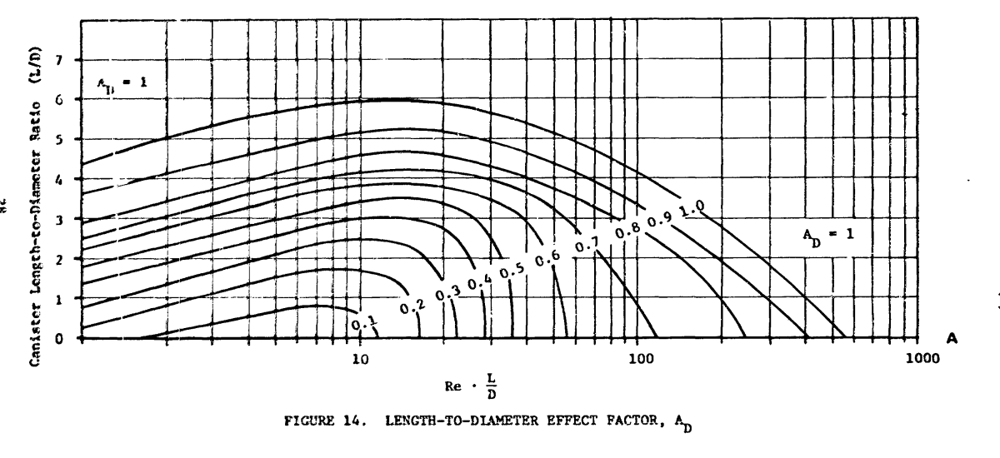
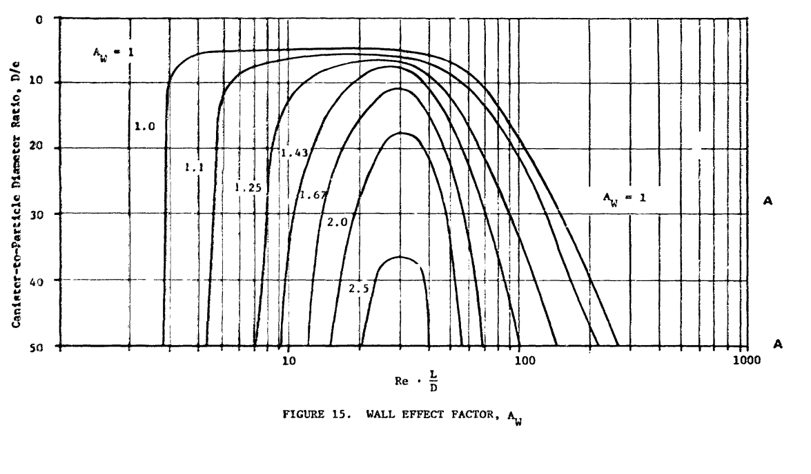

# CO2 Scrubber Bedlife Estimation

Calculations made following this Navy dive [manual](https://apps.dtic.mil/sti/tr/pdf/ADA160181.pdf). Slight modifications made to account for dead volume.

## Pre-conditions

Temperature: 

\(T=70\:F\)
{: .center-text}

Pressure at analysis depth: 

\(P_{depth}=1.6\:bar\) or \(1.5790768\:ata\)
{: .center-text}

CO2 injection rate for scrubber evaluation: 

\(rate_{CO2}=1.6\:L/min\)
{: .center-text}

Tidal lung capacity:

\(V\llap{-}_{tidal}=3\:L\)
{: .center-text}

Per breath fractional oxygen consumption in each breath (Assuming \(V\llap{-}_{in} = V\llap{-}_{out}\)): 

\(O2_{consumption\:fraction}=0.04\) 
{: .center-text}

Guppy CCR dead volume:  

\(V\llap{-}_{dead}=0.1753128081\:L\)
{: .center-text}

Fractional increase required to compensate for dead volume: 

\(V\llap{-}_{percent\:inc}=1.058437603\)
{: .center-text}

## Scrubber dimensions

Axial scrubber length:

\(L_{canister}=0.62\:ft\)
{: .center-text}

Axial scrubber diameter:

\(D_{canister}=0.31\:ft\)
{: .center-text}

Axial scrubber aspect or length to diameter ratio:

\(L/D=2\)
{: .center-text}

## CO2 concentration in gas stream 

Respiratory quotient: 

\(RQ=0.85\)
{: .center-text}

Pre-compensation oxygen consumption: 

\(VO2_{pre-comp}=RATE_{CO2}/RQ=1.882352941\:L/min\:at\:STPD\)
{: .center-text}

Approximate respiratory minute volume (No dead volume compensation): 

\(RMV_{pre-comp}=VO2/O2_{consumption\:fraction}=47.05882353\:L\) 
{: .center-text}

Approximate respiratory minute volume (Dead volume compensated): 

\(RMV=RMV_{pre-comp}*V\llap{-}_{percent\:inc}=49.80882836\:L\) 
{: .center-text}

Compensated oxygen consumption (See manual for formula): 

\(VO2=RMV/24=2.075367848\:L/min\:at\:STPD\)
{: .center-text}

Volumetric flow rate to canister:

\(   Q=RMV/28.3168\:L/ft^3=1.758985068\: ft^3/min\)
{: .center-text}

Fraction CO2 concentration in gas stream:

(Would be 1/ata instead of unitless without considering that the numerator is measured assuming STPD conditions)

\(V\llap{-}_{frac,CO_2}=(VO2*RQ/Q*P_{depth})/28.3168\:L/ft^3=0.022428717\)
{: .center-text}

CO2 percentage concentration in gas stream:

\(CO2_{\%}=V\llap{-}_{frac,CO_2}*100=2.2428717\%\)
{: .center-text}

## Surface Level Equivalent

Surface level equivalent CO2 concentration percentage:

\(CO2_{\%\:SLE}=CO2_{\%}*P_{depth}=3.541666667\%\)
{: .center-text}

## Bulk density of absorbent

Sofnolime 797 CO2 Absorbent (Provided by manufacture):

\(\varphi_{absorbent}=0.9\:g/cm^3\)
{: .center-text}

## Absorbent weight

Scrubber canister volume:

\(V\llap{-}_{scrubber\:canister}=\pi*(D_{canister}/2)^2*L_{canister}*1728\:in^3/ft^3=80.86278535\:in^3\)
{: .center-text}

Absorbent weight:

\(W_{absorbent}=V\llap{-}_{scrubber\:canister}*\varphi_{absorbent}*16.3871\:cm^3/in^3*0.00220462\:lbm/g=2.629220762\:lbm\)
{: .center-text}

## Density of CO2 at operating pressure

CO2 molecular weight:

\(M_{CO2}=44.01\:lbm/lbm\text{-}mole\)
{: .center-text}

Pressure absolute:

\(P_{abs}=P_{depth}*14.6959\:lbf/in^2/ata=23.20595475\:lbf/in^2\)
{: .center-text}

Universal gas constant:

\(R=1544\:ft\:lbf/lb\text{-}mole*\,^{\circ}\text{R}\)
{: .center-text}

Temperature (Rankine):

\(T_{R}=T+459.67=529.67\,^{\circ}\text{R}\)
{: .center-text}

Density of CO2 at operating pressure:

\(\varphi_{CO2}=(M_{CO2}*P_{abs}/R*T_{R})*144\:in^2/ft^2=0.179829373\:lbm/ft^3\)
{: .center-text}

## Absorbent capacity 
Data used for this calculation is taken from [this](https://www.divegearexpress.com/amfile/file/download/file/76) Sofnolime 797 laboratory report.  

All abbreviations used in this section are local context only.

Ambient pressure during test:

\(P_{test}=3\:bar\)
{: .center-text}

Measured average absorbent capacity:

\(Absorbent_{capacity}=107L(CO2)/kg(Sofnolime)\)
{: .center-text}

Mass of absorbent used:

\(M_{absorbent}=1kg\)
{: .center-text}

Temperature:

\(T_{test}=277.15K\)
{: .center-text}

Ideal gas constant:

\(R = 0.08314462618\:L*bar/K*mol\)
{: .center-text}

Volume of CO2:

\(V\llap{-}_{CO2}=107L\)
{: .center-text}

[Van der Waals](https://www.engineeringtoolbox.com/non-ideal-gas-van-der-Waals-equation-constants-gas-law-d_1969.html) number of moles calculation utilizing the Van der Waals equation of state:

\[(P + a (n / V)^2) (V / n - b) = R T\]

\[a = 3.658\:bar*L^2 / mole^2\]

\[b = 0.04286\:L/mole\]

Determine coefficients for the Van der Waals cubic polynomial:

\[a_{3}\:x^3+a_{2}\:x^2+a_{1}\:x+a_{0}\]

\[a_{3} = a*(b/(V\llap{-}_{CO2})^2)=0.00001369393659\]

\[a_{2} = - a/V\llap{-}_{CO2}=-0.03418691589\]

\[a_{1}=P_{test}*b+R*T_{test}=23.17211315\]

\[a_{0}=-P_{test}*V\llap{-}_{CO2}=-321\]

[Solving](https://www.calculatorsoup.com/calculators/algebra/cubicequation.php) this cubic polynomial, the non-imagery solution is:

\[n=14.14643\:moles\]

Total mass of CO2:

\[M_{total\:CO2}=n*M_{CO2}=622.5702379\:g=0.6225702379\:kg\]

Absorbent capacity in terms of mass/mass:

\[Absorbent_{capacity\:mass}=0.6225702379\:kg(CO2)/kg(Absorbent)\]

## Theoretical bed life

\[T_{theoretical}=(Absorbent_{capacity\:mass}*W_{absorbent})/(Q*CO2_{fraction}*\varphi_{CO2})=230.72156796723\:min\]

## Superficial velocity through scrubber canister

\[v_{superficial}=Q/(\pi*(D_{canister}/2)^2)*(1/60)s/min\]

## Mean absorbent particle diameter

\[e=0.005577427822\:ft\]

## Density of O2 at operating pressure

O2 molecular weight:

\[M_{O2}=31.999\:lbm/lbm\text{-}mole\]

Density of CO2 at operating pressure:

\[\varphi_{O2}=(M_{O2}*P_{abs}/R*T_{R})*144\:in^2/ft^2=0.1307511953\:lbm/ft^3\]

## Fractional O2 concentration in gas stream

Assuming pure oxygen addition to gas stream:

\[V\llap{-}_{frac,O_2}=1-V\llap{-}_{frac,CO_2}=0.977571283\]

## Density of gas stream 

\[\varphi_{gas}=\varphi_{O2}*V\llap{-}_{frac,O_2}+\varphi_{CO2}*V\llap{-}_{frac,CO_2}=0.1318519559\:lbm/ft^3\]

## Viscosity of constituent carbon dioxide gas

Formula found in appendix C:

\[\mu_{CO2}=147.48 * ((459.67 + T)/529.67)^{0.999}=147.48\:\mu P\]

## Viscosity of constituent oxygen gas

Formula found in appendix C:

\[\mu_{O2}=202.99 * ((459.67 + T)/529.67)^{0.784}=202.99\:\mu P\]

## Viscosity of gas stream

Formula is Wilke's semi-empirical method found in appendix C:

\[\mu_{\text{mix}} = \sum_{i=1}^{n} \frac{x_i \mu_i}{\sum_{j=1}^{n} x_j \Phi_{ij}}\]

\[\Phi_{ij} = \frac{\left[1 + \left(\frac{\mu_i}{\mu_j}\right)^{1/2} \left(\frac{M_j}{M_i}\right)^{1/4}\right]^2}{\sqrt{8}\left(1 + \frac{M_i}{M_j}\right)^{1/2}}\]

Calculation of interaction parameters:

\[\Phi_{O2,\:O2}= \frac{\left[1 + \left(\frac{\mu_{O2}}{\mu_{O2}}\right)^{1/2} \left(\frac{M_{O2}}{M_{O2}}\right)^{1/4}\right]^2}{\sqrt{8}\left(1 + \frac{M_{O2}}{M_{O2}}\right)^{1/2}}=1\]

\[\Phi_{O2,\:CO2}=\frac{\left[1 + \left(\frac{\mu_{O2}}{\mu_{CO2}}\right)^{1/2} \left(\frac{M_{O2}}{M_{CO2}}\right)^{1/4}\right]^2}{\sqrt{8}\left(1 + \frac{M_{O2}}{M_{CO2}}\right)^{1/2}}=1.386886759\]

\[\Phi_{CO2,\:O2}=\frac{\left[1 + \left(\frac{\mu_{CO2}}{\mu_{O2}}\right)^{1/2} \left(\frac{M_{CO2}}{M_{O2}}\right)^{1/4}\right]^2}{\sqrt{8}\left(1 + \frac{M_{CO2}}{M_{O2}}\right)^{1/2}}=0.7326297077\]

\[\Phi_{CO2,\:CO2}=\frac{\left[1 + \left(\frac{\mu_{CO2}}{\mu_{CO2}}\right)^{1/2} \left(\frac{M_{CO2}}{M_{CO2}}\right)^{1/4}\right]^2}{\sqrt{8}\left(1 + \frac{M_{CO2}}{M_{CO2}}\right)^{1/2}}=1\]

Viscosity of gas stream:

\[\mu_{\text{mix,1}} = \frac{V\llap{-}_{frac,O_2} * \mu_{O_2}}{V\llap{-}_{frac,O_2} * \Phi_{11} + V\llap{-}_{frac,CO_2} * \Phi_{12}}=143.9818919 \: \mu P\]

\[\mu_{\text{mix,2}} = \frac{V\llap{-}_{frac,CO_2} * \mu_{CO_2}}{V\llap{-}_{frac,O_2} * \Phi_{21} + V\llap{-}_{frac,CO_2} * \Phi_{22}}=4.478294877 \: \mu P\]

\[\mu_{\text{mix}} = \mu_{\text{mix,1}} + \mu_{\text{mix,2}} = 148.4601868 \: \mu P\]

\[\mu_{\text{mix}} = \mu_{\text{mix}} / 10^6*0.1\:Pa\text{-}s/P*0.67197\:lbm/ft\text{-}s/Pa\text{-}s=0.00000997607917\:lbm/ft\text{-}s\]

## Particle Reynolds number

\[Re = \frac{\varphi_{gas}*v_{superficial}*e}{\mu_{\text{mix}}}=28.63243486\]

## Product Reynolds number and canister aspect ratio

This number is needed for graph reading:

\[Re*L/D=57.26486972\]

## Reading the canister efficiency graph 

{ align=center }

Canister efficiency as read from Figure 4 is approximately: 
{: .center-text}

\[\eta_{graph}=0.175\]

## Reading the temperature effect factor graph 

{ align=center }

The temperature effect factor as read from Figure 11 is approximately: 
{: .center-text}

\[A_{T}=1\]

## Reading the humidity effect factor graph 

{ align=center }

The humidity effect factor as read from Figure 12 is approximately: 
{: .center-text}

\[A_{H}=1\]

## Reading the CO2 injection rate factor graph 

{ align=center }

The CO2 injection rate factor as read from Figure 13 is approximately: 
{: .center-text}

\[A_{C}=0.675\]

## Reading the length-to-diameter factor graph 

{ align=center }

The length-to-diameter factor as read from Figure 14 is approximately: 
{: .center-text}

\[A_{D}=0.65\]

## Reading the wall effect factor graph 

{ align=center }

The wall effect factor as read from Figure 15 is approximately: 
{: .center-text}

\[A_{W}=2\]

## Actual canister efficiency

\[\eta_{actual}=\eta_{graph}*A_{T}*A_{H}*A_{C}*A_{D}*A_{W}=0.1535625\]

## Predicted canister bed life

\[T_{actual}=T_{theoretical}*\eta_{actual}=35.43018078\:min\]
