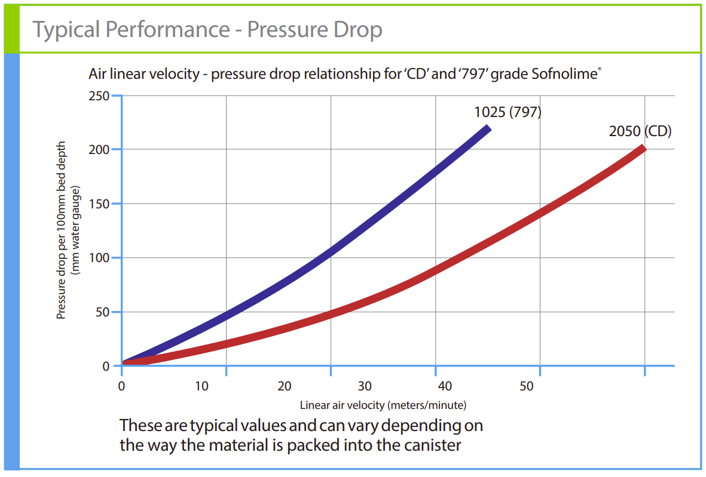

# Work of Breathing Analysis

## Pre-conditions

\[V\llap{-}_{scrubber\:canister}=80.86278535\:in^3=0.04679559337\:ft^3\]

\[r_{min}=0.04166666667\:ft\]

\[r_{max}=0.25\:ft\]

\[Q=1.758985068\:actual \frac{ft^3}{min}=0.8301485053\:\frac{L}{s}\]

\[\varphi_{mix}=0.1318519559\:\frac{lbm}{ft^3}\]

\[e=0.005577427822\:ft\]

\[\mu_{\text{mix}} = 0.00000997607917\:\frac{lbm}{ft\text{-}s}\]

## Analytical Analysis Method and Parameters

Maximum allowable pressure deferential across the CO2 scrubber per volumetric flow rate before the work of breathing exceeds diver comfort limits per the Navy dive [manual](https://apps.dtic.mil/sti/tr/pdf/ADA160181.pdf).

\[\frac{\Delta P_{scrubber\:max}}{Q}=2.9\:\frac{cm\text{-}H2O}{\frac{L}{S}}\]

Laminar to turbulent Reynolds number threshold:

\[Re_{threshold}=40\]

Scrubber canister wall factor:

\[Wall=1\]

Friction factors:

Re < 40

\[f_{<40} \approx \frac{850}{Re} \]

Re >= 40 

\[f_{>=40} \approx \frac{38}{Re}^{0.15} \]

Reynolds number calculation for radial scrubber using superficial velocity:

\[Re = \frac{\rho \cdot v \cdot e}{\mu}\]

\[\downarrow\]

\[Re = v \cdot \frac{\rho \cdot e}{\mu}\]

\[\downarrow\]

\[Re = \frac{Q}{2 \cdot \pi \cdot r \cdot L} \cdot \frac{\rho \cdot e}{\mu}\]

Pressure drop for a radial scrubber (Nuckols, Deason, technical manual equation used at start):

\[\Delta\:P = \frac{4 \cdot L_B \cdot \rho \cdot v^2 \cdot A_f \cdot f}{2 \cdot g \cdot e} \]

\[\downarrow\]

\[\Delta\:P = v^2 \cdot \frac{4 \cdot L_B \cdot \rho \cdot A_f \cdot f}{2 \cdot g \cdot e}\]

\[\downarrow\]

\[\Delta\:P = \left(\frac{Q}{2 \cdot \pi \cdot r \cdot L}\right)^2 \cdot \frac{4 \cdot L_B \cdot \rho \cdot A_f \cdot f}{2 \cdot g \cdot e}\]

\[\downarrow\]

\[\Delta\:P = \left(\frac{Q}{2 \cdot \pi \cdot r \cdot L}\right)^2 \cdot \frac{4 \cdot L_B \cdot \rho \cdot A_f}{2 \cdot g \cdot e} \cdot f\]

## \(Re\:\) and \(\Delta\:P\) calculations:

Absorbent bed length per calculation:

Radius:

\[\Delta_{radius}=0.002\:ft\] 

$$ \small
\begin{array}[!ht]
    \centering
    \begin{array}{|l|l|l|}
    \hline
        Radius\:(from\:center) (ft) & Re & \Delta P\:(\frac{lbf}{ft^2}) \\ \hline
        0.04166666667 & 33.67389853 & 0.01548098465 \\ \hline
        0.04366666667 & 32.13158256 & 0.01477193191 \\ \hline
        . \\ \hline
        . \\ \hline
        . \\ \hline
        0.2656666667 & 5.281351714 & 0.002428008884 \\ \hline
    \end{array}
\end{array} $$

Full table can be found [here](../../appendix.md).
{: .center-text}

Change in pressure summation:

\[\Delta\:P=0.6064973389\:lbf/ft^2=0.2961162607\:cm\text{-}H2O\]

## Work of breathing from analytical analysis:

\[WOB=\frac{\Delta\:P}{Q}=0.3567027572\:\:\frac{cm\text{-}H2O}{\frac{L}{S}}\]

## Empirical Analysis Method and Parameters 

{align=center}

From the pressure drop graph we can roughly approximate the Sofnolime 797 line as linear then find the slope:

\[slope\approx\frac{\frac{50\:mm\:H2O}{100\:mm\:bed\:length}}{10\:\frac{m}{min}}\]

\[\downarrow\]

\[slope\approx0.05\: \frac{\frac{\:mm\:H2O}{\:mm\:bed\:length}}{\:\frac{m}{min}}\]

\[\downarrow\]

\[slope\approx 3 \: \frac{\frac{\:mm\:H2O}{\:mm\:bed\:length}}{\:\frac{m}{sec}}\]

\[\downarrow\]

\[slope\approx 0.9143999707 \: \frac{\frac{\:mm\:H2O}{\:mm\:bed\:length}}{\:\frac{ft}{sec}}\]

\[\downarrow\]

\[slope\approx 278.7091111 \: \frac{\frac{\:mm\:H2O}{\:ft\:bed\:length}}{\:\frac{ft}{sec}}\]

## \(\Delta\:P\) calculations:

Absorbent bed length per calculation:

Radius:

\[\Delta_{radius}=0.002\:ft\] 

$$ \small
\begin{array}[!ht]
    \centering
    \begin{array}{|l|l|l|}
    \hline
        Radius\:(from\:center) (ft) & \Delta V\:(\frac{ft}{s}) & \Delta P\:(mmH2O) \\ \hline
        0.04166666667 &	0.4568070004 & 0.254632546 \\ \hline
        0.04366666667 & 0.4358845424 & 0.2429699867\\ \hline
        . \\ \hline
        . \\ \hline
        . \\ \hline
        0.2656666667 & 0.07164476167 & 0.03993609568 \\ \hline
    \end{array}
\end{array} $$

Full table can be found [here](../../appendix.md).
{: .center-text}

Change in pressure summation:

\[\Delta\:P = 9.975719575\:mm\text{-}H2O = 0.9975719575\:cm\text{-}H2O \]

## Work of breathing from empirical analysis:

\[WOB=\frac{\Delta\:P}{Q}=1.201678918\:\:\frac{cm\text{-}H2O}{\frac{L}{S}}\]