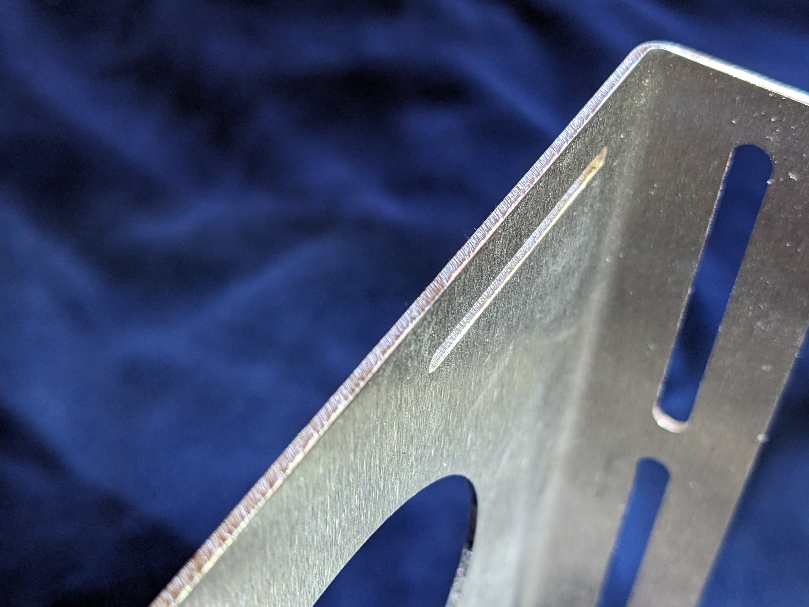
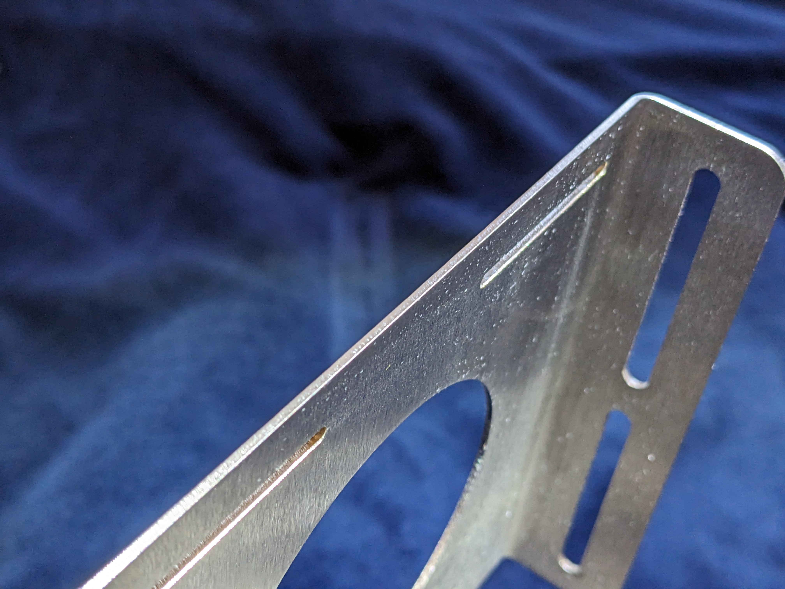
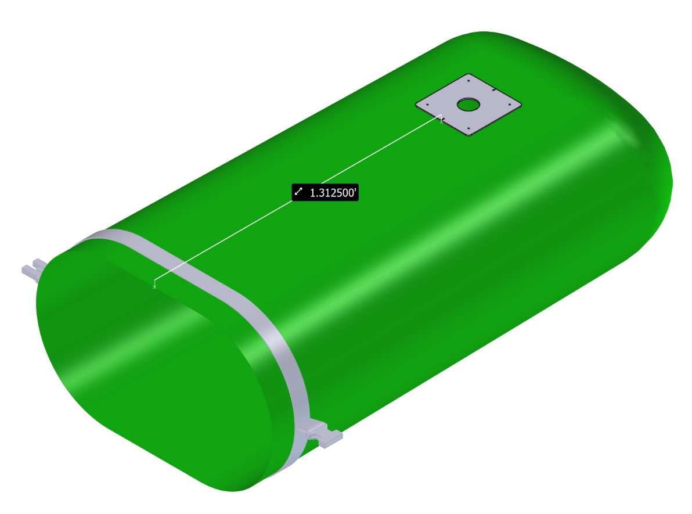
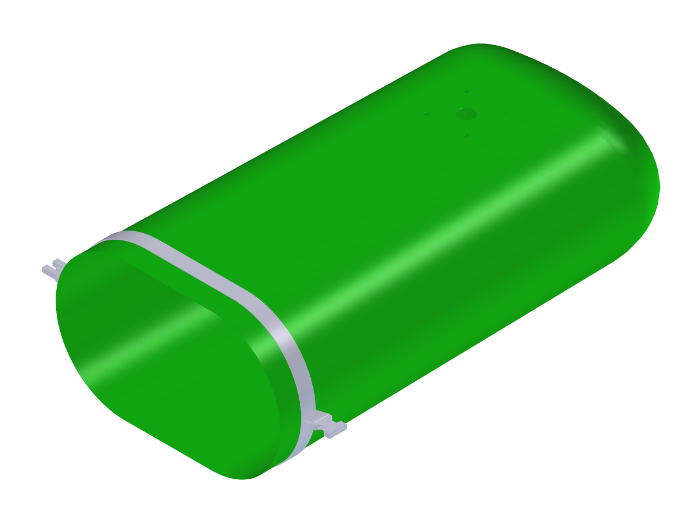
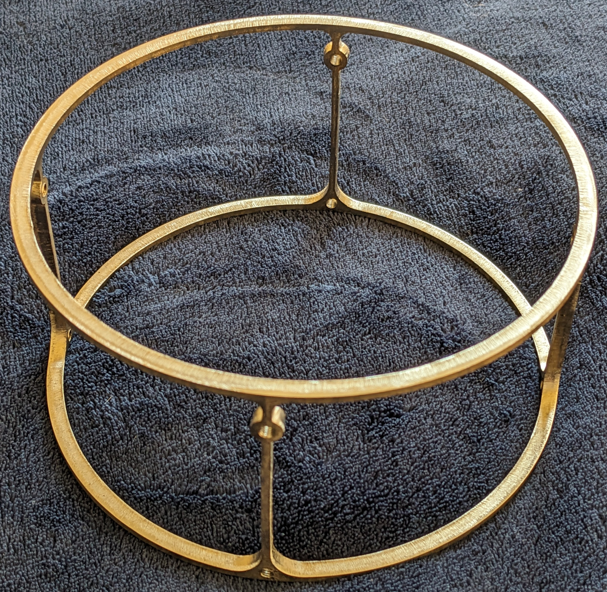
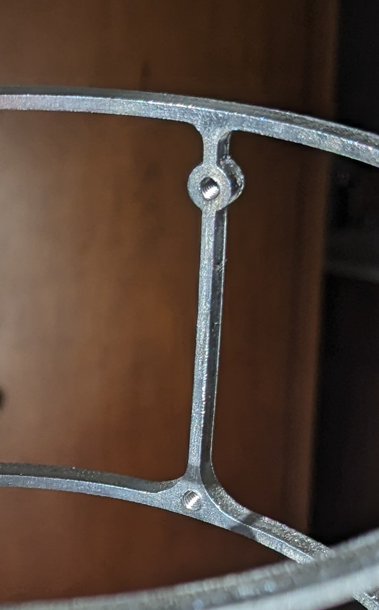
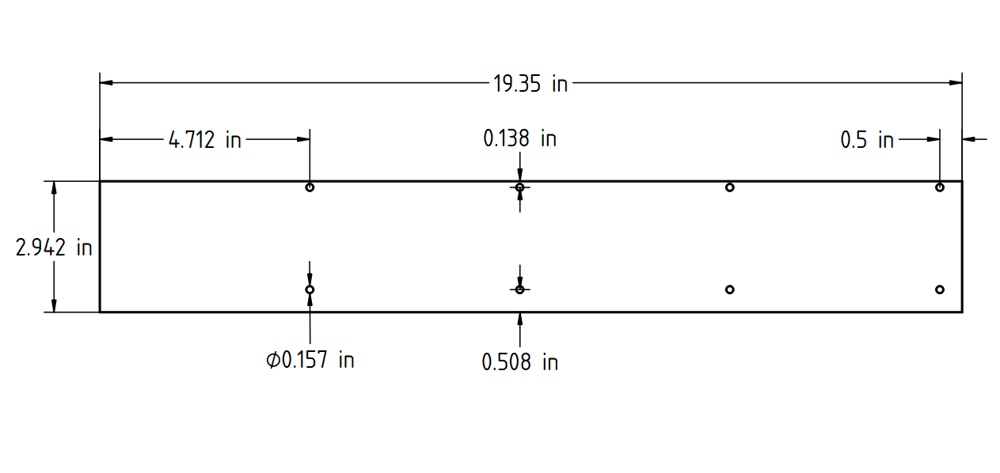
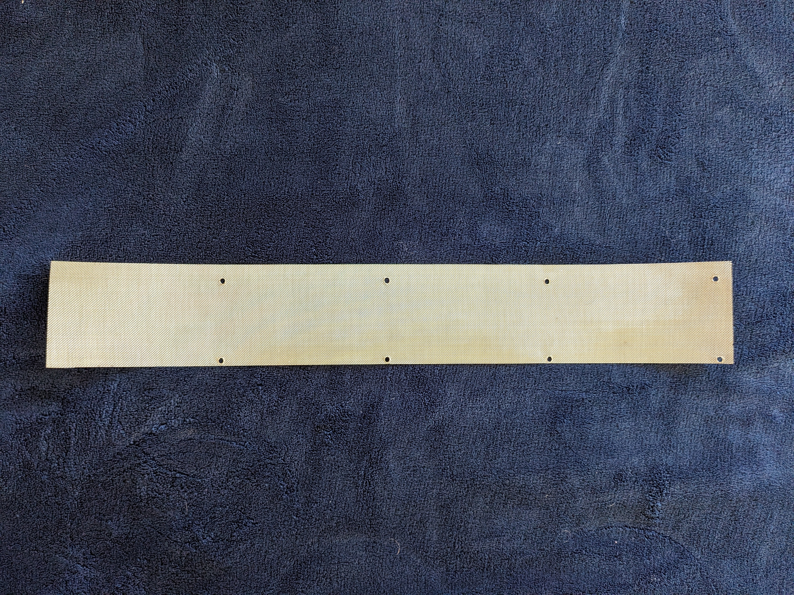

# Preparing the parts 

## Metal part edge filing

Upon receiving the stainless steel CNC cut parts make sure to feel the edges and sand/file down any sharp areas you find. Example pictures shown below.

#### Before: {: .center-text}

{ align=center }

#### After: {: .center-text}

{ align=center }

## Counterlung 

To prepare the NRS 15L dry bag for use as the Guppy counterlung do the following: 

* Place the hole jig in the center of the counterlung with the bottom edge 1.3125 feet or 15.75 inches from the opening of the bag. Use the center notches in the jig to help with alignment.

* Carefully trace out the required holes.

* Place a small cutting mat or board inside the dry bag so you can easily make cuts on one side without damaging the other. 
This is important as any additional punctures in the dry bag will need to be patched.

* Cut out the traced holes with a craft knife, use drill bits for the four outside holes.

#### Before cutting holes: {: .center-text}

{ align=center }

#### After cutting holes: {: .center-text}

{ align=center }

### Scrubber 
Upon receiving the scrubber frame from the CNC cutting service there will most likely be a large build up of slag on the interior from laser cutting. Special care needs to be taken to remove all slag buildup from the frame. Also, care should be taken to clean all surfaces mechanically before building the scrubber to remove any unwanted debris.

{ align=center }

The final step in preparing the frame is to tap the eight M4 bolt holes as shown below. Use the included M4 cylindrical tapping jig to make the process easier.

{ align=center }

To make the outer scrubber wall mesh to the following:

* Cut out appropriate sized strip from the larger mesh sheet. This is easily done with jeweler's scissors.

* Using a small diameter center punch create the first set of two holes that are 0.5 inches from the edge.

* Attach the mesh to the frame with the two existing holes, then wrap the mesh around the frame, using it as a jig, and repeat the hole creation process with the center punch. 

{ align=center }

{ align=center }